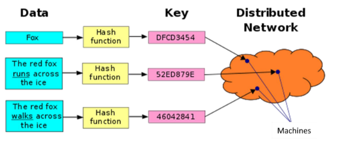
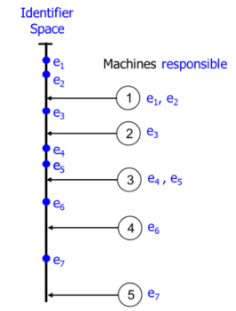
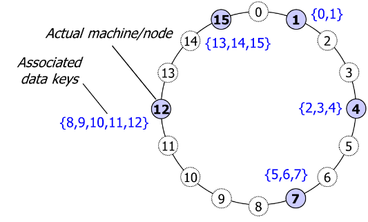
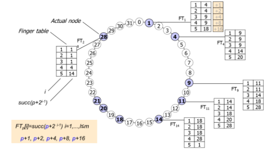
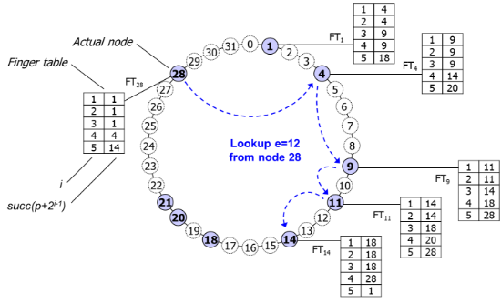
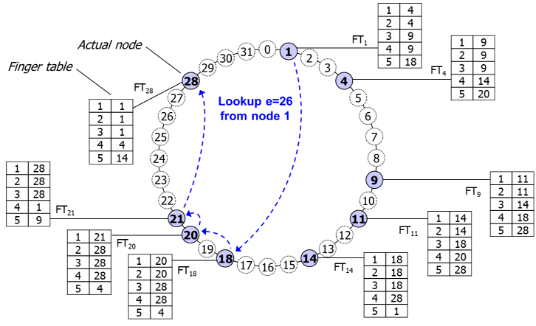

**CS2001: Data Structures (Fall 2023)** 

**Semester Project** 

**Project groups:** This project can be done within a group of three (3) students. There is no restriction on the selection of group members. Students can make groups according to their preferences. The group members may belong to different sections.  

**Submission:** All submissions MUST be uploaded on Google classroom. Solutions sent to the emails will not be graded. To avoid last-minute problems (unavailability of Internet, load shedding etc.), you are strongly advised to start working on the project from day one. 

Combine all your work (solution folder) in one .zip file after performing “Clean Solution”. Submit zip file  on  slate  within  given  deadline.  If  only  .cpp  file  is  submitted  it  will  not  be  considered  for evaluation.  

**Plagiarism: Zero marks** in the project for all members if any significant part of project is found plagiarized. A code is considered plagiarized if **more than 20%** code is not your own work.  

**InterPlanetary File System (IPFS)** 

IPFS provides functionality similar to BitTorrent making it extremely easy to publish your content and make it accessible anywhere, anytime. The obvious way to make use of IPFS is file sharing. This is perhaps the only use of IPFS that you are going to implement in this project, however, IPFS is capable of much more. In particular, the following properties of IPFS will be handled by your implementation.  

- IPFS files are content addressable. It means that each file is represented by the hash of its content. This hash is used to search and retrieve the file instead of filename. In other words, two files with the same name but different content will have different hash values.   
- IPFS files/folders are not located on a single machine but rather stored on multiple machines geo- distributed across the internet. A data structure named Distributed Hash Table (DHT) is used to manage storage/retrieval of files across different machines on the Internet.  

**Distributed Hash Table (DHT)** 

As mentioned above, we are considering a scenario where the data (i.e., IPFS file/folder) is not located on a single machine but rather stored on multiple machines geo-distributed across the Internet. In such a scenario, searching or retrieval of  data is very challenging, as it is hard to determine on which machine the required data is stored. The data structures used for efficiently search data stored on a single machine such as hash tables cannot be directly employed in a distributed environment. Figure 1 shows the concept of data/ storage and lookup in a distributed environment.   ![ref1]

*Figure 1* 

Typically, data is stored as a *key*, *value* pair. For example, *key* might be the name of the student, or the student ID and *value* is the complete information about the student. Likewise, the *key* can be the name of the patient and *value* can be the medical record. Similarly, the *key* can be the name of an image file and *value* represents the file itself. **Nevertheless, in IPFS the key is the hash value of the file and value is the actual file (i.e., its content).**  

A distributed hash table (DHT) provides a lookup (or search) service similar to a hash table: (key, value) pairs are stored in  a DHT  and any participating  machine can efficiently retrieve the value associated  with  a  given  key.  Responsibility  for  maintaining  the  mapping  from  keys  to  values  is distributed among the machines. In particular,  

- Each  DHT  has  an  Identifier  space.  Identifier  space  refers  to  the  range  of  possible  keys  (or identifiers) that can be stored. For example, if the identifier space is 4-bits, it means that a total of sixteen key/value pairs can be stored (i.e., 16 files can be stored) with their hash values (i.e., keys or ids) mapped to the range [0,15].  
- Hash function such as SHA-1 is used to map key to identifier space. For example, in Figure 2 a key is mapped to an id e1 in the identifier space. Another key is mapped to the id e2 and so on.  
- Machines (responsible for storing the files) are also mapped into identifier space using the hash function on their name such as google.com.  
- Each machine is responsible for a range of ids in the identifier space. For example, Figure 2 depicts that machine 1 is responsible for storing the data (i.e., key, value pairs) whose keys are mapped to e1 and e2. Likewise, machine 3 is responsible for the ids e4 and e5. 
- When a machine leaves, its id range is merged with a neighbor’s range. For example, according to Figure 2 machine 4 will be responsible for the ids in the range e4 to e6, in case machine 3 leaves the network.  
- Likewise, when a new machine joins, the id range of neighbor is subdivided.  ![ref1]

*Figure 2* 

In this project, we will implement a special type of DHT that has a circular identifier space, named Ring DHTs. As most of the students are not familiar with the concepts of computer networks and distributed  systems,  the  following  description  simplifies  many  aspects  of  the  DHT  and  primarily focuses on emulating the DHT functionality on a single machine.  

**Properties of Ring DHT** 

- Ring  DHT  uses  160-bit  circular  identifier  space  using  SHA-1.  Figure  3  shows  only  a  4-bit identifier space to simplify the explanation. 

  **Implementation Notes:** In your implementation, the size of identifier space shall be configurable by the user.  

- Randomly chosen identifiers  (ids in  short) are assigned to  machines (also called nodes in  the following): H(Mahcine Name) → Node Id or Machine ID. Figure 3 shows 5 machines with ids 1, 4, 7, 12 and 15. 
- Randomly  chosen  identifiers  are  assigned  to  data,  i.e.  (key,  value)  pairs:  key → H(file content) 
- Data (i.e., IPFS file) with identifier e is stored on the node/machine p with the smallest identifier p 

  ≥ e.  This node/machine  is called successor of e, denoted as succ(e). For example, Figure  3 depicts that machine with id 12 is responsible for storing the  files  with ids 8,9,10,11  and  12, because all these ids are less than or equal to the id of machine 12. The files with all these ids might not be available for storage but if such a file arrives this machine, i.e., machine with id 12, will be used for storage. Likewise, a machine with id 4 is responsible for storing files with ids 2, 3 and 4 (if available). ![ref1]

*Figure 3* 

- Each machine internally stores the data (i.e., IPFS files) in the form of a B-tree. **Kindly note** that the example in Figure 3 is very simplistic, however, in reality a machine might be required to store millions of keys, value pairs.  

  Given  the  key  (i.e.,  hash  of  a  file)  the  actual  file  is  found  in  two  steps.  First,  the  machine responsible for storing the file is searched. In other words, the machine with the Ids less than or equal to the hash of the file (as mentioned above) is searched. Once the machine (on which the file is stored) is identified, B-tree searching is used to retrieve the path on which this file is stored on the hard disk.  

**Implementation notes:** From the implementation perspective, you are supposed to make a circular singly linked list of machines.  

**Implementation notes:** The B-tree is used to index keys. The corresponding values (i.e., files) are stored on the file system. For example,  

- Key = Hash of the file wizard of OZ, Value = actual movie in mp4 file format stored on the file system. 

**Implementation notes:** Instead of large movie files, use simple text files with less content.  

**Search Algorithm** 

The request to search a file (i.e., key = hash of file content) can arrive on any machine. The machine will first determine whether the file is locally stored, i.e., id e of the file is less than or equal to the id p of the machine (p ≥ e). If the file is not locally found, the search request is forwarded to the next node in the circular linked list and so on. This very simple search algorithm is not very efficient with a complexity of O(N), where N is the number of machines in the distributed system. Why? ![ref1]

To efficiently resolve data identifier e to machine succ(e), each machine p contains routing table FTp of at most O(log N) entries, where N is the number of machines in the distributed system. Each routing table entry i contains the shortcut/pointer to the distant node not directly connected on the circular linked list, i.e., FTp[i]=succ(p + 2i-1), where i=1,...,l≤log(N). Figure 4 shows a 5-bit identifier space. The FT of machine 1 includes the links (also called shortcuts or pointers) to the machines with Ids 4, 9 and 18, i.e., succ, for the ids (1+1), (1+2), (1+4), (1+8), (1+16).  

**Note**: Figure 4 depicts the routing tables of machines with ids 1, 4, 9, 11, 14 and 28. Try to construct these routing tables by hand to properly understand the concept of shortcuts.  

*Figure 4* 

**Implementation notes:** The routing table is implemented as a doubly linked list. The routing table entries will maintain the address/pointer of the linked list node that corresponds to the machine.   

Given the properly maintained routing tables, the search query will be routed as follows: 

- A machine p receives a key, i.e., key = e and starts the process to search for the corresponding value.  
- Machine p receiving search(e) considers following cases: 
- p=e, i.e. value/file is stored on the same machine. Use B-tree search to find the data and return the results. 
- p < e and e ≤ FTp [1]. In this case, the search request is forwarded to the machine FTp[1], i.e., first entry of routing table entry. 
- FTp[j] < e ≤ FTp[j+1]. In this case the search request is forwarded to the machine FTp[j]. 

**Note:** The identity space is circular and modulus operation is required. It is omitted in the above description for the sake of simplicity.  

The above search algorithm using routing table will result in O(log N) lookups, where N is the number of machines in the system. Why? Figure 5 shows the working of the above algorithm, where the search query for a file with key = 12 originates at node 28. It is forwarded by node 28 to node 4 (using the pointer maintained in the routing table), node 4 forwarded it to node 9 which in turn forward it to node 11 and finally once node 14 receives the search query it uses B-tree search to find the actual location of the file on the hard drive. 

*Figure 5* 

Figure 6 depicts another example of the searching for data with key = 26 starting from node 1.  

*Figure 6 ![ref1]*

**New machine joining** 

When a new machine joins, the following steps are performed. 

- H(Machine Name) = p is  calculated and machine is placed in the ring accordingly. 
- The routing table of p is initialized, and routing table of other machines will be updated. 
- Id range will be subdivided between p and succ(p+1), i.e., each data e with e ≤ p* is moved from succ(p+1)* to p. The B- trees will be adjusted accordingly. 

**Machine leaving** 

In this project, we assume that machines leave gracefully, i.e., all the stored files are distributed to other machine(s) before departure from the network. This may result in the redistribution of Id ranges and adjustment to the B- trees.  

**Data Storage query** 

The data storage request can arrive on any machine. On receiving the key, value pair, a machine will first find the key = H(content of file) = e. An algorithm similar to the search will be used to arrive at machine that is succ(e) and responsible for storing the data.  

**Commands:** Your project must support the following commands and options. 

1. Option to specify the number of machines. 
1. Option to specify the size of identifier space in bits, i.e., 160 bits, 4 bits etc.  
1. Option to manually assign Id to each machine. If manual Ids are not assigned by the user, the system must automatically assign Ids. 
1. Option to insert files in the form of key, value pairs from any machine. The insertion must show the complete path taken by the request to arrive at the correct machine. Additionally, the option to print B-tree.  
1. Option  to  remove  data  by  specifying  the  key  from  any  machine.  The  output  must  show  the complete path taken by the request to arrive at the correct machine and corresponding value that is removed from the B-tree. The updated B- tree must be printed. 
1. Option to print the routing table of any machine. 
1. Option to add new machines on the fly without disrupting the functionality of Ring DHT. 
1. Option to remove any machine on the fly without disrupting the functionality of Ring DHT. 

**What to submit** 

Submit  your  code  for  this  project,  programmed  in  C++  using  Visual  Studio  2019.  A  document highlighting the design in terms of relationships/associations between different classes of your program must be submitted. The code needs to be well documented so that grader can get a good idea of what each of your procedures do.  

Program modularity, clarity, documentation etc., along with correct implementation will be considered for grading. 

**Good Luck! ![ref1]**

[ref1]: images/Aspose.Words.fb95235f-aa15-481a-9000-a50f0ac41db1.002.png
